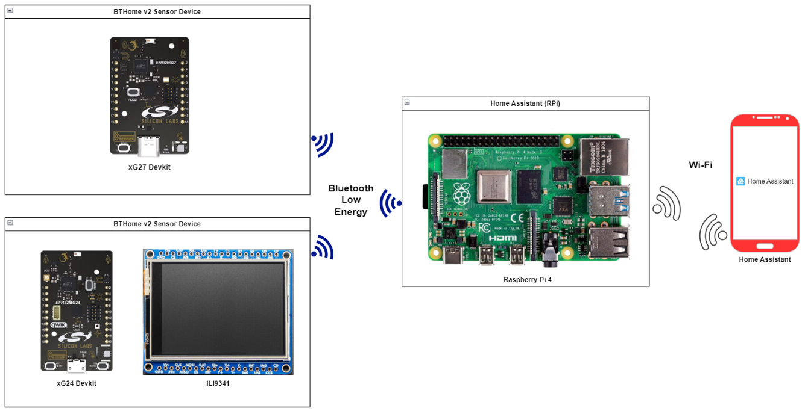
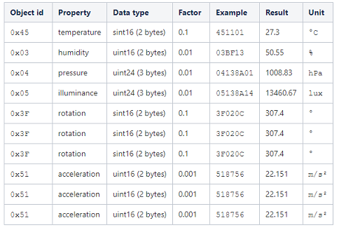
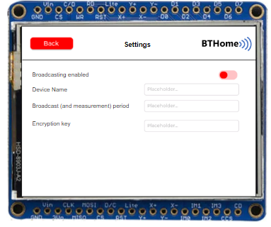
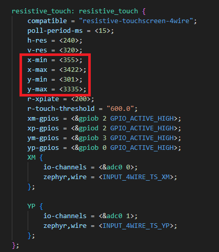
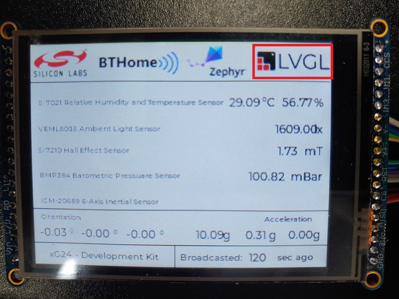
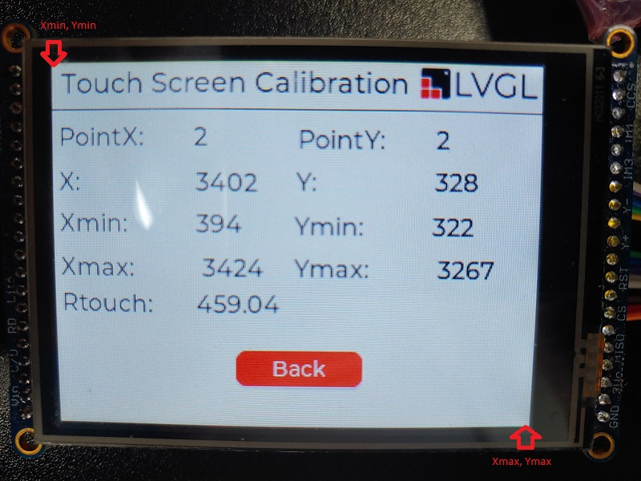
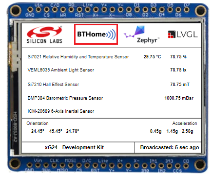

# Zephyr - BTHome v2 - xG24/xG27 sensors with LVGL #


[](https://www.adafruit.com/product/1770)


## Summary ##

This example demonstrates communication between xG24 and xG27 Dev Kits, based on Zephyr OS and a Home Assistant server. By using the Home Assistant, you could monitor sensor values, such as temperature, humidity, illuminance, etc. Additionally, it is also possible to interact with devices by touching the screen directly, which is designed with the LVGL library.

## Zephyr version ##

- [Zephyr 4.0.0](https://github.com/zephyrproject-rtos/zephyr/tree/v4.0.0)

## Hardware Required ##

- 1x [xG24-DK2601B](https://www.silabs.com/development-tools/wireless/efr32xg24-dev-kit?tab=overview) EFR32xG24 Development Kit

- 1x [xG27-DK2602A](https://www.silabs.com/development-tools/wireless/efr32xg27-development-kit?tab=overview) EFR32xG27 Development Kit

- 1x [2.8" TFT LCD with Touchscreen Breakout Board w/MicroSD Socket - ILI9341](https://www.adafruit.com/product/1770)

- 1x Raspberry Pi 4 runs Home Assistant OS

- 1x Smartphone runs Home Assistant application

## Connections Required ##

In this example, the EFR32xG24 and EFR32xG27 Development Kits are required. Using the BTHome v2 format, these devices can transmit data to the BTHome server, which is hosted on a Raspberry Pi.



To connect the Adafruit 2.8" TFT LCD (with Touchscreen) with the EFR32xG24 Development Kit, you can see the pins mapping table below.

| EFR32xG24 Dev Kit | Connection | Pin function |
| --- | --- | --- |
| PA6 | D/C | GPIO |
| PA5 | CS | SPI CS |
| PC1 | CLK | SPI SCK |
| PC2 | MISO | SPI MISO |
| PC3 | MOSI | SPI MOSI |
| PB2 | XM(X-) | AN |
| PD2 | XP(X+) | AN |
| PB3 | YM(Y-) | AN |
| PB0 | YP(Y+) | AN |

## Setup ##

To run the example, you should follow the below steps:

1. Run **Command Prompt** as administrator, initialize the workspace for the project and download the required package. For more information, see the [setting up environment](../../README.md#setting-up-environment) section.

2. Change the current working directory to the `zephyrproject` directory using the `cd` command.

3. Build this project by the following commands with each tested board.

   - EFR32xG24 Dev Kit - BRD2601B: **`west build -p -b xg24_dk2601b zephyr_applications/applications/zephyr_bthome_v2/xg24_lvgl`**

   - EFR32xG27 Dev Kit - BRD2602A: **`west build -p -b xg27_dk2602a zephyr_applications/applications/zephyr_bthome_v2/xg27_cli`**

4. Flash the project to the board using **`west flash`** command.

**Note:**

- A patch file needs to be applied to the EFR32xG24 Dev Kit to fix the known bugs. From the `zephyrproject` directory, use the following command to apply:

  `git apply zephyr_applications/applications/zephyr_bthome_v2/xg24_lvgl/patch/Kconfig.gecko_usart.patch`

- Make sure that the Zephyr OS environment has already been installed. To install the Zephyr OS environment, you can refer to [this guide](../../README.md#setting-up-environment).

- You need to install the SEGGER RTT J-Link driver to flash this project to the board. For further information, please refer to [this section](../../README.md#flash-the-application).

## How It Works ##

In this example, ambient space data is measured by the two development kits and subsequently sent BTHome v2 server device. Users can use their mobile phones - after they install the Home Assistant application - to visualize the collected data. The EFR32xG24 Dev Kit is connected to a display, by which users can monitor the sensor data beside the Home Assistant application.

The following table shows the specification of the BTHome v2 data package.



This example contains 2 separate sensor devices. They have similar functions, but have different operation principles.

The xG24 Development Kit is combined with a 2.8" TFT touch LCD, which utilizes the LVGL library. The display is designed to display sensor values, and it also integrates device configuration features. Some features can be configured including:

- Device name
- The encryption key of the BTHome v2 format
- The broadcast interval and measurement time
- Turn ON/OFF broadcasting



## Calibration for Touch function ##

Adafruit ILI9341 uses 4 resistive touch pins (Y+ X+ Y- X-) to determine touch points. We will read the analog values from these pins to detect where the touched point is on the screen. This process will surely have uncertainties so we have to calibrate it to detect touched points properly. Please follow these steps below to calibrate the touch screen.

The calibration parameters can be configured through the settings of the device tree overlay of the board, which is located in applications/xg24_lvgl/boards/xg24_dk2601b.overlay:



Follow the steps below to calibrate the touch screen.

1. Enter calibration mode by tapping on the LGVL logo

   

2. Measuring 2 points at 2 conners: top left (Xmin, Ymin), bottom right (Xmax, Ymax)
    - Calib Xmin: minimum raw value of X
    - Calib Xmax: maximum raw value of X
    - Calib Ymin: minimum raw value of Y
    - Calib Ymax: maximum raw value of Y

    

3. Use 4 parameters: Xmin, Ymin, Xmax, Ymax as the properties of the resistive node in the device tree overlay.

4. Rebuild the project

### Device Configuration ###

#### EFR32xG24 Development Kit ####

Since the EFR32xG24 Development Kit is connected to a touch screen, users can use this to configure the operation of the device. Tap on the BTHome logo on the main screen to enter the configuration mode. Users can configure the device operation on the second screen.



#### EFR32xG27 Development Kit ####

The EFR32xG27 Development Kit is not connected to any screen; therefore, we have to use the [shell](https://docs.zephyrproject.org/latest/services/shell/index.html) to configure it. Open any terminal on your computer and run the following commands:

- Enable / Disable broadcasting:

   ```C
   xg27_bthome set_broadcast 1 / 0
   ```

- Set broadcast interval:

   ```C
   xg27_bthome set_broadcast_interval [broadcast interval ms]
   ```

- Set device name:

   ```C
   xg27_bthome set_device_name [device name (shorter than 9 characters)]
   ```

- Set encryption key:

   ```C
   xg27_bthome_client set_encryption_key [encryption key (32 characters)]
   ```

### Output ###

To finish the configuration for both devices, users need to enable broadcast. After that, it is possible to monitor data via the Home Assistant application off the cell phone.

By the xG27 Dev Kit device, launch Console, which is integrated into Simplicity Studio or use a third-party terminal tool like Putty or Tera Term to receive the data from the USB interface.

As the result of this example, you can see the threshold and the measured values of the magnetic induction.


