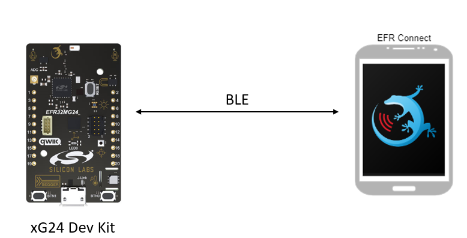
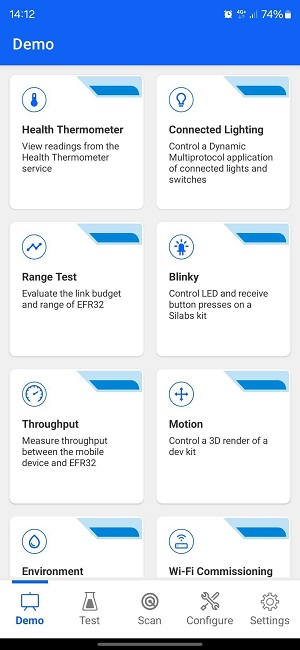

# Zephyr - Simplicity Connect Demo - Blinky #

## Summary ##

The example demonstrates how the Zephyr OS is supported by the development kits of Silicon Labs. In this example, you can use a BLE central device to control the LED on the mainboard and receive button press notifications.

## Zephyr version ##

- [Zephyr 4.0.0](https://github.com/zephyrproject-rtos/zephyr/tree/v4.0.0)

## Hardware Required ##

- 1x [Bluetooth Low Energy Development Kit](https://www.silabs.com/development-tools/wireless/bluetooth). Tested boards for working with this example:

   | Board ID | Description  |
   | -------- | ------------ |
   | BRD4184B | [SLTB010A](https://www.silabs.com/development-tools/thunderboard/thunderboard-bg22-kit?tab=overview) EFR32BG22 Thunderboard Kit |
   | BRD2601B | [xG24-DK2601B](https://www.silabs.com/development-tools/wireless/efr32xg24-dev-kit?tab=overview) EFR32xG24 Dev Kit |
   | BRD2602A | [xG27-DK2602A](https://www.silabs.com/development-tools/wireless/efr32xg27-development-kit?tab=overview) EFR32xG27 Development Kit |

- 1x Smartphone runs the Simplicity Connect Mobile App

## Connections Required ##

In this example, the kit connects to a mobile phone via BLE.

- Kit sends the button state to mobile phone
- Kit receives LED control data from mobile phone

## Setup ##

To run the example, you should follow the below steps:

1. Run **Command Prompt** as administrator, initialize the workspace for the project and download the required package, please refer to the [setting up environment](../../README.md#setting-up-environment) section.

2. Change the current working directory to the `zephyrproject` directory using the `cd` command.

3. Build this project by the following commands with each tested board. Make sure to change the board name to the right one that you have.

   - EFR32BG22 Thunderboard Kit - BRD4184B: **`west build -p -b sltb010a zephyr_applications/applications/zephyr_efr_connect_demo_blinky`**
   - EFR32xG24 Dev Kit - BRD2601B: **`west build -p -b xg24_dk2601b zephyr_applications/applications/zephyr_efr_connect_demo_blinky`**
   - EFR32xG27 Dev Kit - BRD2602A: **`west build -p -b xg27_dk2602a zephyr_applications/applications/zephyr_efr_connect_demo_blinky`**

4. Flash the project to the board using **`west flash`** command.

**Note:**

- Make sure that the Zephyr OS environment is already installed. For installing the Zephyr OS environment, you can refer to [this guide](../../README.md#setting-up-environment).

- You need to install the SEGGER RTT J-Link driver to flash this project to the board. For further information, please refer to [this section](../../README.md#flash-the-application).

## How It Works ##

This example implements a simple custom GATT service with two characteristics

- **LED Control**: This characteristic controls the state of the LED (ON/OFF) via write operations from a GATT client.
- **Report Button**: This characteristic sends notifications to subscribed clients when the button state changes (pressed or released).

To test this demo, install Simplicity Connect for [Android](https://play.google.com/store/apps/details?id=com.siliconlabs.bledemo&hl=en&gl=US) or [iOS](https://apps.apple.com/us/app/id1030932759).

After launching the app go to the 'Demo' tab and select the Blinky demo. A pop-up will show all the devices around you that are running the SoC-Blinky firmware. Tap on the device to go into the demo view.

 

Tap the light on the mobile app to toggle the LED on the mainboard. When you press/release the button on the mainboard the state changes for the virtual button on the app as well.

 

The animation below showcases the demo running on an EFR32xG24 Dev Kit with the mobile app running on an iPhone.

