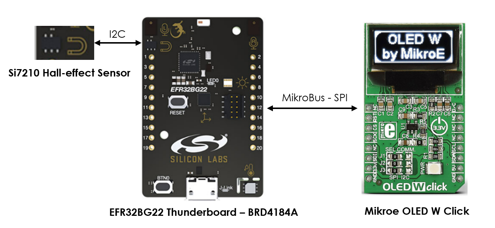
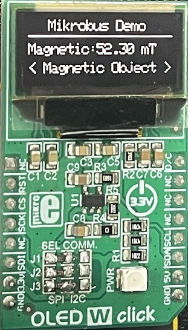
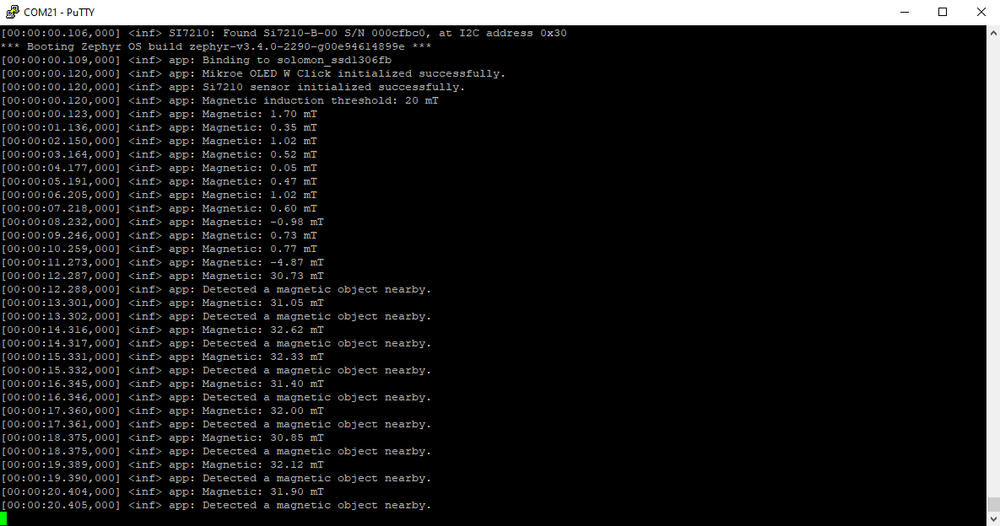
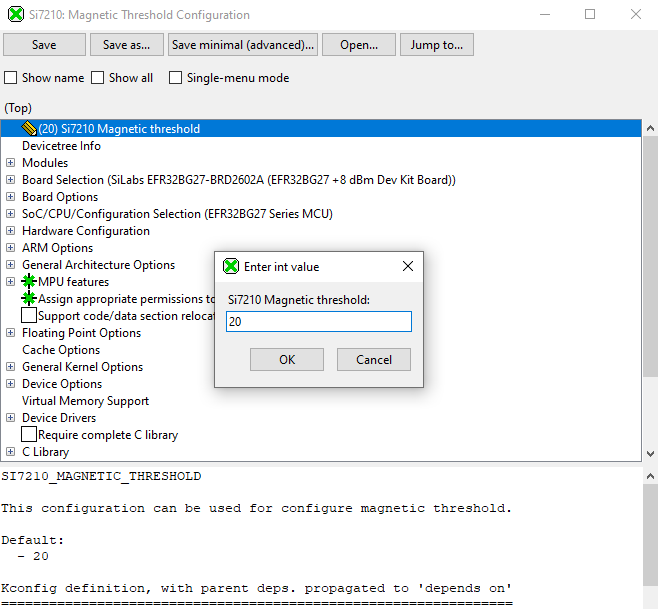

# Zephyr - MikroBus Demo #

## Summary ##

The example demonstrates how the Zephyr OS is supported by the development kits of Silicon Labs. In this example, you can see the utilization of the built-in Si7210 Hall Effect Magnetic sensor and a MikroE OLED W Click board.

The application makes the detection of magnetic objects possible and it interacts with the OLED board. This Mikroe OLED W Click is used for visualizing sensor data. It shows the detection result if there is a nearby magnetic object, which has a magnetic induction value greater than the threshold of the board.

## Hardware Required ##

 - [EFR32BG22 Thunderboard Kit - BRD4184A](https://www.silabs.com/development-tools/thunderboard/thunderboard-bg22-kit?tab=overview)

 - [MikroE OLED W Click](https://www.mikroe.com/oled-w-click)

**NOTE:**
Tested boards for working with this example:

| Board ID | Description  |
| ---------------------- | ------ |
| BRD4184A | [EFR32BG22 Thunderboard Kit - BRD4184A](https://www.silabs.com/development-tools/thunderboard/thunderboard-bg22-kit?tab=overview)    |

## Connections Required ##

The following picture shows the system view of how it works.

The boards and OLED W display can connect via the SPI interface. You can make the connection according to the table below:

| EFR32BG22 Thunderboard Kit  | Mikroe OLED W |
|:-------|:------:|
|  2 (VMCU)  |  Vin  |
|  1 (GND)  |  GND  |
|  8 (PC2)  |  SCK  |
| 4 (PC0)  |  SDI  |
|  10 (PB2)  |  CS  |
|  9 (PC7)  |  D/C  |
|  13 (PB1)  | RST  |

## Setup ##

To run the example, you should follow the below steps:

1. Run **Command Prompt** as administrator, initialize the workspace for the project and download the required package, please refer to the [setting up environment](../../README.md#setting-up-environment) section.
   
2. Change the current working directory to the `zephyrproject` directory using the `cd` command.

3. Copy the `drivers/display/ssd1306.c` file to the `zephyrproject/zephyr/drivers/display` directory (overwriting the existing file).

4. Build this project by the following commands with each tested board.

   - EFR32BG22 Thunderboard - BRD4184A: **`west build -p always -b efr32bg22_brd4184a zephyr_applications/applications/zephyr_mikrobus_demo`**

5. Flash the project to the board using **`west flash`** command.

**Note:**

- Make sure that the Zephyr OS environment is already installed. For installing the Zephyr OS environment, you can refer to [this guide](../../README.md#setting-up-environment).

- You need to install the SEGGER RTT J-Link driver to flash this project to the board. For further information, please refer to [this section](../../README.md#flash-the-application).

## How It Works ##

This example demonstrates the utilization of the MikroBus connector with the Silabs EFR32BG22 Thunderboard Kit on Zephyr OS.

The Mikroe OLED W Click is used for visualizing sensor data. The display will show the magnetic induction value every second. If this value is greater than the threshold, the <Magnetic Object> text visible on the screen as you can see in the following image.

You can launch a Console that is integrated into Simplicity Studio or use a third-party terminal tool like Putty or Tera Term to receive the data from the USB.  You can see the threshold of magnetic induction and its value is logged out to your screen. You also receive a notification about the indication of a magnetic object when it is nearby. A screenshot of the console output is shown in the figure below.

You can configure the magnetic configuration value by running `west build -t menuconfig` or `west build -t guiconfig` command on this example working directory, which has the **Kconfig** file. Then, the project configuration window will appear as below.

|  | |
| - | - |

After finishing the configuration, you have to re-build this example before flashing it to the board.
