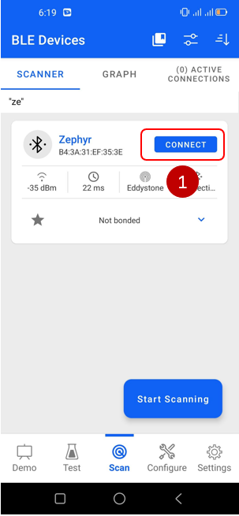
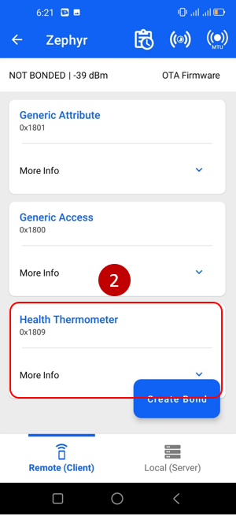
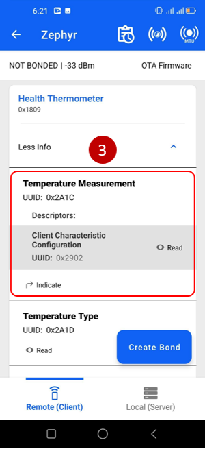
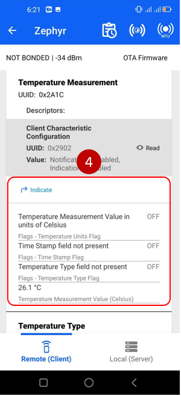

# Zephyr - Bluetooth - Modified SoC Thermometer #

## Summary ##

This example implements the Health Thermometer service. It enables a peer device to connect and receive temperature values via Bluetooth. The reported values are measured by a temperature sensor located on the mainboard.

## Hardware Required ##

- [EFR32xG24 Dev Kit](https://www.silabs.com/development-tools/wireless/efr32xg24-dev-kit?tab=overview)

**NOTE:**
Tested boards for working with this example:

| Board ID | Description  |
| ---------------------- | ------ |
| BRD2601B | [EFR32xG24 Dev Kit - BRD2601B](https://www.silabs.com/development-tools/wireless/efr32xg24-dev-kit?tab=overview)    |
| BRD2602A | [EFR32xG27 Dev Kit - BRD2602A](https://www.silabs.com/development-tools/wireless/efr32xg27-development-kit?tab=overview)    |

## Connections Required ##

In this example, the only hardware required is the EFR32xG24 Dev Kit. Central devices will receive temperature sensor data from the Dev Kit via Bluetooth Low Energy (BLE).

## Setup ##

To run the example, you should follow the below steps:

1. Run **Command Prompt** as administrator, initialize the workspace for the project and download the required package, please refer to the [setting up environment](../../README.md#setting-up-environment) section.
   
2. Change the current working directory to the `zephyrproject` directory using the `cd` command.

3. Build this project by the following commands with each tested board.

   - EFR32xG24 Dev Kit - BRD2601B: **`west build -p -b efr32xg24_dk2601b zephyr_applications/applications/zephyr_modified_soc_thermometer`**

   - EFR32xG27 Dev Kit - BRD2602A: **`west build -p -b efr32bg27_brd2602a zephyr_applications/applications/zephyr_modified_soc_thermometer`**

4. Flash the project to the board using **`west flash`** command.

**Note:**

- Make sure that the Zephyr OS environment is already installed. For installing the Zephyr OS environment, you can refer to [this guide](../../README.md#setting-up-environment).

- You need to install the SEGGER RTT J-Link driver to flash this project to the board. For further information, please refer to [this section](../../README.md#flash-the-application).

## How It Works ##

This example implements the predefined Thermometer Service. The Health Thermometer service exposes temperature and other data from a thermometer intended for healthcare and fitness applications.

To test this demo, install EFR Connect for [Android](https://play.google.com/store/apps/details?id=com.siliconlabs.bledemo&hl=en&gl=US) or [iOS](https://apps.apple.com/us/app/efr-connect-ble-mobile-app/id1030932759).

After launching the app go to the scan view and try to find **Zephyr** the connect to it. A pop-up will show all the services and characteristics of it.

|  | 

To monitor the temperature, select Health Thermometer service, and then tap the Indicate button on Temperature measurement characteristic, now the temperature will update periodically.

|  | 

You also see the log from the thermometer device to track the status.

