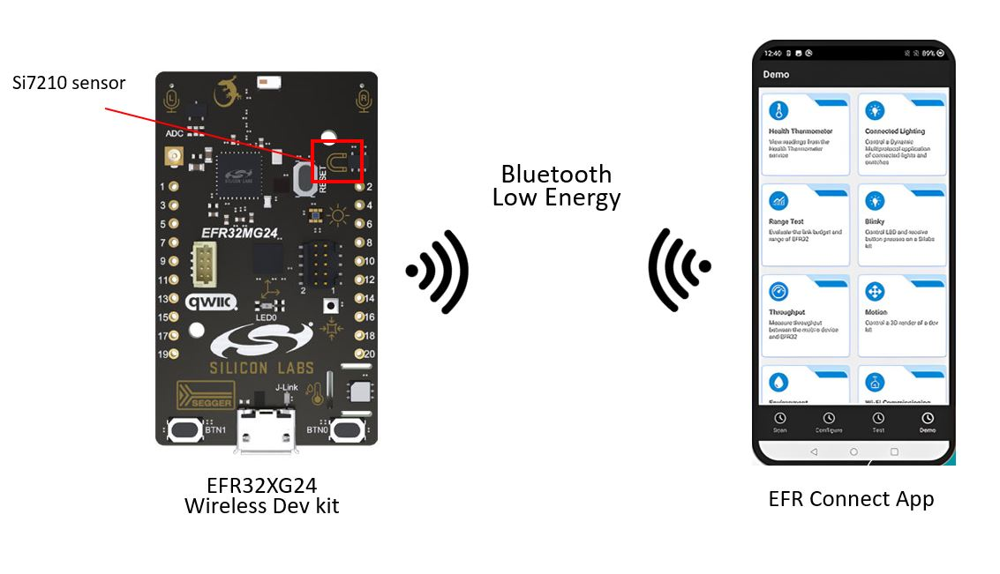
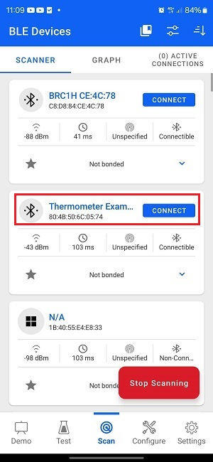
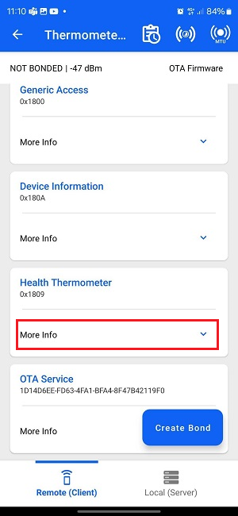
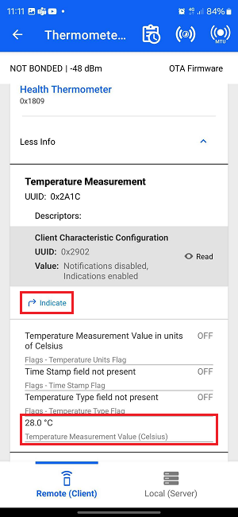
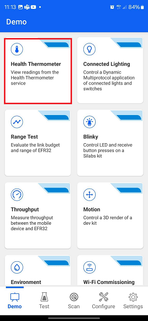
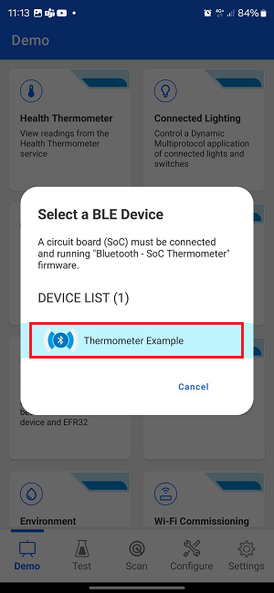
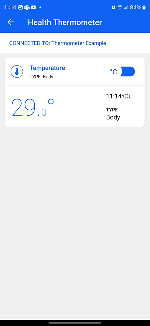
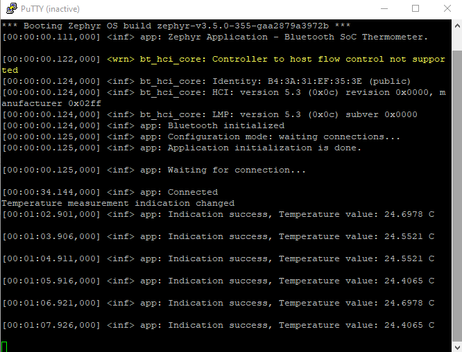

# Zephyr - Bluetooth - Modified SoC Thermometer #

## Summary ##

This example implements the Health Thermometer service. It enables a peer device to connect and receive temperature values via Bluetooth. The reported values are measured by a temperature sensor located on the mainboard.

## Zephyr version ##

- [Zephyr 4.0.0](https://github.com/zephyrproject-rtos/zephyr/tree/v4.0.0)

## Hardware Required ##

- 1x [Bluetooth Low Energy Development Kit](https://www.silabs.com/development-tools/wireless/bluetooth). Tested boards for working with this example:

   | Board ID | Description  |
   | -------- | ------------ |
   | BRD2601B | [xG24-DK2601B](https://www.silabs.com/development-tools/wireless/efr32xg24-dev-kit?tab=overview) EFR32xG24 Dev Kit |
   | BRD2602A | [xG27-DK2602A](https://www.silabs.com/development-tools/wireless/efr32xg27-development-kit?tab=overview) EFR32xG27 Development Kit |

- 1x Smartphone runs the Simplicity Connect Mobile App

## Connections Required ##

In this example, the only hardware required is the EFR32xG24 Dev Kit. Central devices will receive temperature sensor data from the Dev Kit via Bluetooth Low Energy (BLE).

## Setup ##

To run the example, you should follow the below steps:

1. Run **Command Prompt** as administrator, initialize the workspace for the project and download the required package, please refer to the [setting up environment](../../README.md#setting-up-environment) section.

2. Change the current working directory to the `zephyrproject` directory using the `cd` command.

3. Build this project by the following commands with each tested board.

   - EFR32xG24 Dev Kit - BRD2601B: **`west build -p -b xg24_dk2601b zephyr_applications/applications/zephyr_modified_soc_thermometer`**

   - EFR32xG27 Dev Kit - BRD2602A: **`west build -p -b xg27_dk2602a zephyr_applications/applications/zephyr_modified_soc_thermometer`**

4. Flash the project to the board using **`west flash`** command.

**Note:**

- Make sure that the Zephyr OS environment is already installed. For installing the Zephyr OS environment, you can refer to [this guide](../../README.md#setting-up-environment).

- You need to install the SEGGER RTT J-Link driver to flash this project to the board. For further information, please refer to [this section](../../README.md#flash-the-application).

## How It Works ##

This example implements the predefined Thermometer Service. The Health Thermometer service exposes temperature and other data from a thermometer intended for healthcare and fitness applications.

To test this demo, install Simplicity Connect for [Android](https://play.google.com/store/apps/details?id=com.siliconlabs.bledemo&hl=en&gl=US) or [iOS](https://apps.apple.com/us/app/efr-connect-ble-mobile-app/id1030932759).

1. Open the Simplicity Connect app on your smartphone and allow the permission requested the first time it is opened.

2. Click [Scan]. You will see a list of nearby devices that are sending Bluetooth advertisement. Find the one named "Thermometer Example" and click the connect button on the right side.

   

3. Wait for the connection to establish and GATT database to be loaded, then find the Health Thermometer service, and click More Info.

   

4. Four characteristics will show up. Find the Temperature Measurement and press the indicate button. Then, you will see the temperature value getting updated periodically.

   

Alternatively, you can follow the steps below instead of steps 2-4 to use the Health Thermometer feature in the app. This will automatically scan and list devices advertising the Health Thermometer service and, upon connection, will automatically enable notifications and display the temperature data.

 

To monitor the temperature, select Health Thermometer service, and then tap the Indicate button on Temperature measurement characteristic, now the temperature will update periodically.

You also see the log from the thermometer device to track the status.

