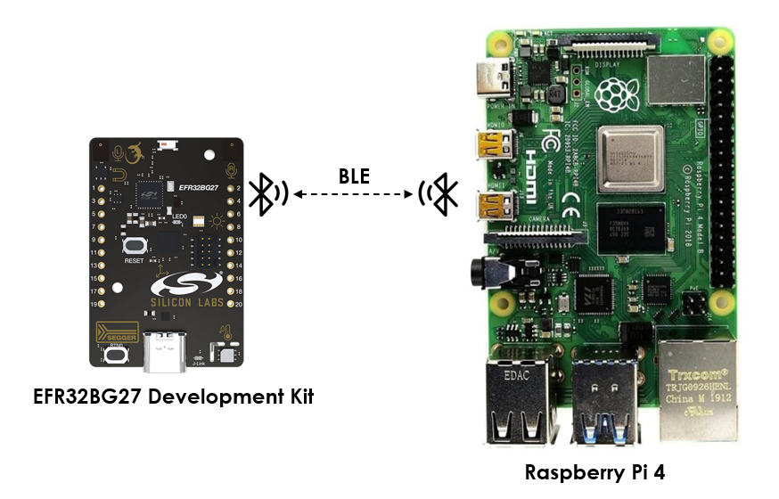
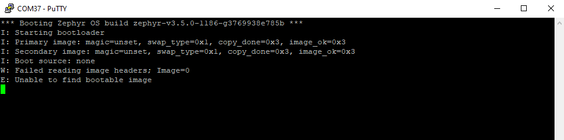
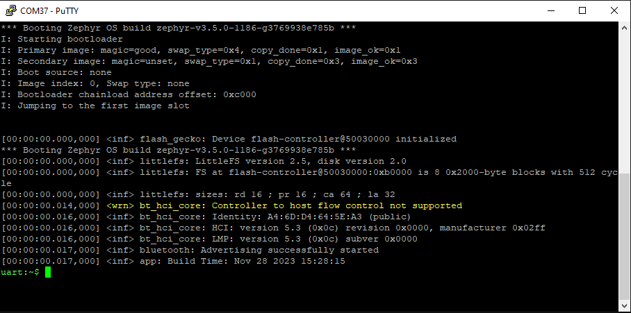
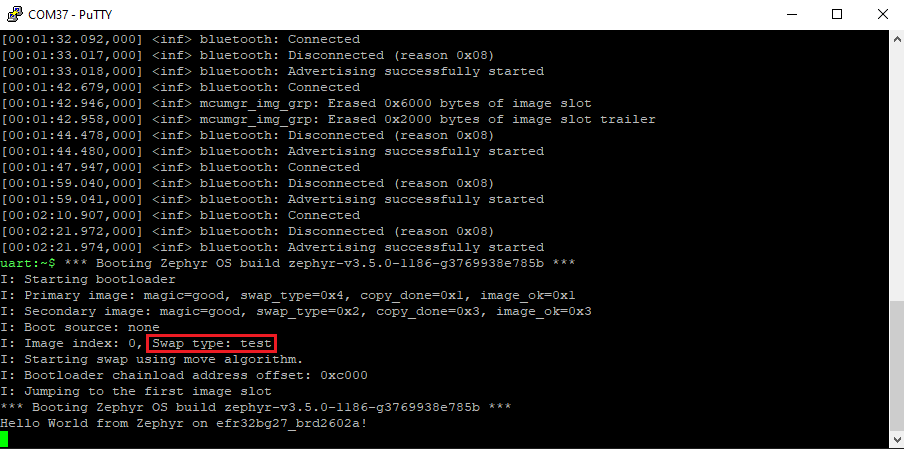
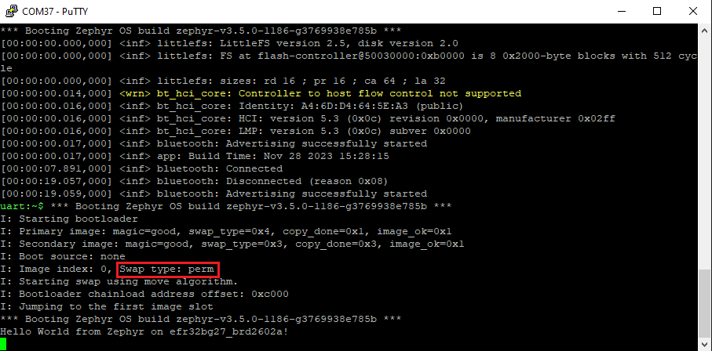

# Zephyr - OTA Firmware Update over BLE #

## Summary ##

The vision of this project is to provide developers with clear examples of **OTA firmware updates** over Bluetooth Low Energy (BLE) with the Zephyr OS on various Silicon Labs development kits.

## Hardware Required ##

 - [EFR32xG27 Development  Kit - DK2602A](https://www.silabs.com/development-tools/wireless/efr32xg27-development-kit?tab=overview)

 - A Linux machine supports the BLE feature or a [Raspberry Pi 4](https://www.raspberrypi.com/products/raspberry-pi-4-model-b/) runs Linux.

**NOTE:**
Tested boards for working with this example:

| Board ID | Description  |
| -------- | ------------ |
| BRD2602A | [EFR32xG27 Development  Kit - DK2602A](https://www.silabs.com/development-tools/wireless/efr32xg27-development-kit?tab=overview) |
| BRD4184A | [EFR32BG22 Thunderboard Kit - BRD4184A](https://www.silabs.com/development-tools/thunderboard/thunderboard-bg22-kit?tab=overview) |
| BRD2601B | [EFR32xG24 Development  Kit - DK2601B](https://www.silabs.com/development-tools/wireless/efr32xg24-dev-kit?tab=overview) |

## Connections Required ##

The following picture shows the system view of how it works.

## Setup ##

### Building and flashing MCUboot ###

The below steps describe how to build and run the MCUboot bootloader:

1. Run **Command Prompt** as administrator and active Zephyr environment.

2. Change the current working directory to `zephyrproject/bootloader/mcuboot/boot/zephyr` directory.

3. Build the bootloader project using the commands below with each tested board

   - EFR32BG22 Thunderboard Kit - BRD4184A: **`west build -p -b efr32bg22_brd4184a`**

   - EFR32xG27 Development Kit - DK2602A: **`west build -p -b efr32bg27_brd2602a`**

   - EFR32xG24 Development Kit - DK2601B: **`west build -p -b efr32xg24_dk2601b`**

4. Flash the project to the board using **`west flash`** command.

After flashing the bootloader, you could launch a terminal like Putty or Tera Term to see the output and make sure the bootloader runs properly.

### Building and flashing the example #

The example is based on SMP Server example, which implements a Simple Management Protocol (SMP) server. SMP is a basic transfer encoding for use with the MCUmgr management protocol. The management subsystem allows remote management of Zephyr-enabled devices over transports, e.g. Bluetooth Low Energy (BLE), Serial (UART), and UDP over IP.

This example uses BLE and the image management operation of MCUmgr to update new firmware for Zephyr-enabled devices over BLE.

To run the example, you should follow the below steps:

1. Run **Command Prompt** as administrator and active Zephyr environment.

2. Change the current working directory to `zephyrproject/zephyr/samples/subsys/mgmt/mcumgr/smp_svr` directory.

3. Build this project by the following commands with each tested board.

   - EFR32BG22 Thunderboard Kit - BRD4184A: **`west build -p -b efr32bg22_brd4184a -- -DCONF_FILE="prj.conf overlay-bt.conf"`**

   - EFR32xG27 Development Kit - DK2602A: **`west build -p -b efr32bg27_brd2602a -- -DCONF_FILE="prj.conf overlay-bt.conf"`**

   - EFR32xG24 Development Kit - DK2601B: **`west build -p -b efr32xg24_dk2601b -- -DCONF_FILE="prj.conf overlay-bt.conf"`**

4. Flash the project to the board using **`west flash --file build/zephyr/zephyr.signed.hex`** command.

**Note:**

- The signed image should be flashed, not the normal image **(zephyr.hex)**. The signed image computes a hash over the image and then signs that hash. The signature is computed by **newt** tool when it’s creating the image. This signature is placed in the image trailer. Then MCUboot is able to validate the new image before allowing it to run.

- When flashing the example successfully, the binary file flashed to slot 0 in the flash memory (primary slot). Normally, the bootloader will only run an image from the primary slot, so images must be built such that they can run from that fixed location in the flash.

### Installing MCU Manager (MCUmgr) tool ###

MCU Manager (MCUmgr) is the application tool that enables a user to communicate with and manage remote devices running an MCUmgr server.

The management subsystem is based on the Simple Management Protocol (SMP) provided by MCUmgr, an open-source project that provides a management subsystem that is portable across multiple real-time operating systems. For more information about MCUmgr and SMP, please see [this document](https://docs.zephyrproject.org/latest/services/device_mgmt/index.html#device-mgmt).

**Note:**

- The mcumgr command-line tool only works with Bluetooth Low Energy (BLE) on Linux and macOS. On Windows, there is no support for Device Firmware Upgrade over BLE yet.
  
To install the tool, you should follow the steps below:

- Install **go**.

- Run the following commands with the specified **go** version.

    - go version < 1.18 : `go get github.com/apache/mynewt-mcumgr-cli/mcumgr`

    - go version >= 1.18 : `go install github.com/apache/mynewt-mcumgr-cli/mcumgr@latest`

For configuring the transport, two command-line options are responsible for setting and configuring the transport layer to use when communicating with the managed device:

- `--conntype` : is used to choose the transport used. In this example, we use BLE transport.

- `--connstring` : is used to pass a comma-separated list of options in the `key=value` format, where each valid `key` depends on the particular `conntype`.

## How It Works ##

You can upload new images to the device. These images will be flashed to slot 1 (secondary slot) in the flash memory. To do that, run the command as below:

    ubuntu@ubuntu:~$ sudo go/bin/mcumgr --conntype ble --connstring 'peer_name=Zephyr' image upload share/zephyr.signed.bin
    18.52 KiB / 18.52 KiB [======================================================================] 100.00% 20.06 KiB/s 0s
    Done

After finishing uploading the new image, you can verify that the new image has been written to the secondary slot by using `image list` command to show all of the images which are stored.

    ubuntu@ubuntu:~$ sudo go/bin/mcumgr -r 3 --conntype ble --connstring 'peer_name=Zephyr' image list                    
    Images:
    image=0 slot=0
        version: 0.0.0
        bootable: true
        flags: active confirmed
        hash: 5725f009611c7265b8ec3d7e3c52c6e099f050daa2883cdf33492c66679728e8
    image=0 slot=1
        version: 0.0.0
        bootable: true
        flags:
        hash: 02698326529dc03122c11f6bcc4d7e2dfa8e74584d30d3f56cd4b4bf0d5716c9
    Split status: N/A (0)

By using hash code, MCUboot could clarify each image in the flash memory. If you want to test the new image, you could use `image test` command. We should use `-r (retries)` option to change the number of retries on timeout and make sure that the command run succeeds. The flags will be changed to `pending`, which means the image in the secondary slot should be run once on the next boot.

    ubuntu@ubuntu:~$ sudo go/bin/mcumgr -r 3 --conntype ble --connstring 'peer_name=Zephyr' image test 02698326529dc03122c11f6bcc4d7e2dfa8e74584d30d3f56cd4b4bf0d5716c9
    Images:
    image=0 slot=0
        version: 0.0.0
        bootable: true
        flags: active confirmed
        hash: 5725f009611c7265b8ec3d7e3c52c6e099f050daa2883cdf33492c66679728e8
    image=0 slot=1
        version: 0.0.0
        bootable: true
        flags: pending
        hash: 02698326529dc03122c11f6bcc4d7e2dfa8e74584d30d3f56cd4b4bf0d5716c9
    Split status: N/A (0)

On the next reboot, the device will run the new image. Because of testing, the new firmware runs one time, and then when you reset the device, it swaps to the original image. 

If the new image works as your expectation, you can confirm that it is the image that you want to run on your device using `image confirm` command. After running this command, your device will run the new firmware permanently. Then the flags will be changed to `pending parmenant`, which means the secondary image will run on the next boot and all subsequent boots.

    ubuntu@ubuntu:~$ sudo go/bin/mcumgr -r 3 --write-rsp --conntype ble --connstring 'peer_name=Zephyr' image confirm 02698326529dc03122c11f6bcc4d7e2dfa8e74584d30d3f56cd4b4bf0d5716c9
    Images:
    image=0 slot=0
        version: 0.0.0
        bootable: true
        flags: active confirmed
        hash: 5725f009611c7265b8ec3d7e3c52c6e099f050daa2883cdf33492c66679728e8
    image=0 slot=1
        version: 0.0.0
        bootable: true
        flags: pending permanent
        hash: 02698326529dc03122c11f6bcc4d7e2dfa8e74584d30d3f56cd4b4bf0d5716c9
    Split status: N/A (0)

