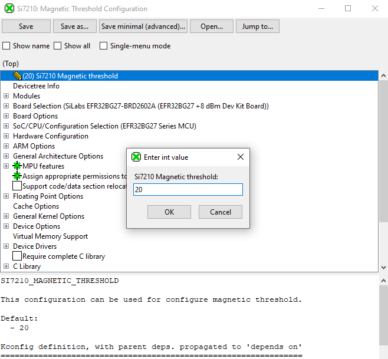

# Zephyr - Si7210 Hall Effect Magnetic Sensor #

## Summary ##

The example demonstrates how the Zephyr OS is supported by the development kits of Silicon Labs. In this example, you can see the utilization of the built-in Si7210 Hall Effect Magnetic sensor and an onboard LED with Zephyr OS.

The application makes the detection of magnetic objects possible, and it interacts with the onboard LED, which turns on to indicate a nearby magnetic object.

## Zephyr version ##

- [Zephyr 4.0.0](https://github.com/zephyrproject-rtos/zephyr/tree/v4.0.0)

## Hardware Required ##

- 1x [Silicon Labs Development Kit](https://www.silabs.com/development-tools). Tested boards for working with this example:

   | Board ID | Description |
   | -------- | ----------- |
   | BRD4184B | [SLTB010A](https://www.silabs.com/development-tools/thunderboard/thunderboard-bg22-kit?tab=overview) EFR32BG22 Thunderboard Kit |
   | BRD2601B | [xG24-DK2601B](https://www.silabs.com/development-tools/wireless/efr32xg24-dev-kit?tab=overview) EFR32xG24 Dev Kit |
   | BRD2602A | [xG27-DK2602A](https://www.silabs.com/development-tools/wireless/efr32xg27-development-kit?tab=overview) EFR32xG27 Development Kit |

## Connections Required ##

You need a USB cable, which connects the board to your computer. The following picture shows the system view.

## Setup ##

To run the example, you should follow the below steps:

1. Run **Command Prompt** as administrator, initialize the workspace for the project and download the required package, please refer to the [setting up environment](../../README.md#setting-up-environment) section.

2. Change the current working directory to the `zephyrproject` directory using the `cd` command.

3. Build this project by the following commands with a kind of tested board.

   - EFR32BG22 Thunderboard - BRD4184B: **`west build -p -b sltb010a zephyr_applications/applications/zephyr_si7210_onboard_led`**

   - EFR32xG24 Dev Kit - BRD2601B: **`west build -p -b xg24_dk2601b zephyr_applications/applications/zephyr_si7210_onboard_led`**

   - EFR32xG27 Dev Kit - BRD2602A: **`west build -p -b xg27_dk2602a zephyr_applications/applications/zephyr_si7210_onboard_led`**

4. Flash the project to the board using **`west flash`** command.

**Note:**

- Make sure that the Zephyr OS environment is already installed. For installing the Zephyr OS environment, you can refer to [this guide](../../README.md#setting-up-environment).

- You need to install the SEGGER RTT J-Link driver to flash this project to the board. For further information, please refer to [this section](../../README.md#flash-the-application).

## How It Works ##

The example demonstrates the capability of magnetic object detection. The built-in Si7210 Hall Effect Magnetic sensor gets the magnetic induction value every second. If this value is greater than the configuration value, the onboard LED will turn on.

You can launch Console that is integrated into Simplicity Studio or use a third-party terminal tool like Putty or Tera Term to receive the data from the USB. You can see the threshold of magnetic induction and its value is logged out to your screen. Moreover, the LED status also displays on the screen. A screenshot of the console output is shown in the figure below.

You can configure the magnetic configuration value by running `west build -t menuconfig` or `west build -t guiconfig` command on this example working directory, which has the **Kconfig** file. Then, the project configuration window will appear as below.

|  | |
| - | - |

After finishing the configuration, you have to re-build this example before flashing it to the board.
