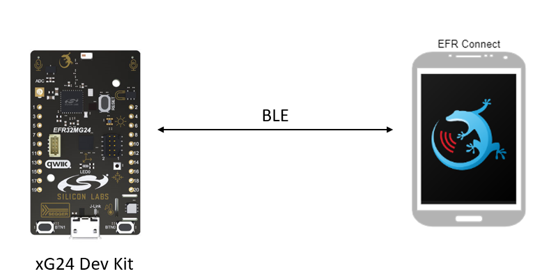
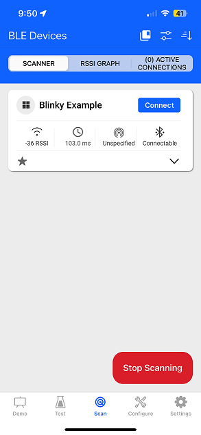
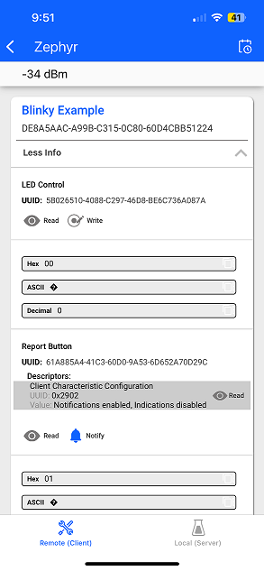

# Zephyr - EFR Connect Demo - Blinky #

## Summary ##

The example demonstrates how the Zephyr OS is supported by the development kits of Silicon Labs. In this example, you can use a BLE central device to control the LED on the mainboard and receive button press notifications.

## Hardware Required ##

- [EFR32xG24 Dev Kit](https://www.silabs.com/development-tools/wireless/efr32xg24-dev-kit?tab=overview)

**NOTE:**
Tested boards for working with this example:

| Board ID | Description  |
| ---------------------- | ------ |
| BRD4184A | [EFR32BG22 Thunderboard Kit - BRD4184A](https://www.silabs.com/development-tools/thunderboard/thunderboard-bg22-kit?tab=overview)    |
| BRD2602A | [EFR32xG27 Development Kit - BRD2602A](https://www.silabs.com/development-tools/wireless/efr32xg27-development-kit?tab=overview)    |
| BRD2601B | [EFR32xG24 Dev Kit - BRD2601B](https://www.silabs.com/development-tools/wireless/efr32xg24-dev-kit?tab=overview)    |

## Connections Required ##

In this example, the only hardware required is the EFR32xG24 Dev Kit. Central devices will transmit data to the Dev Kit via Bluetooth Low Energy (BLE).

## Setup ##

To run the example, you should follow the below steps:

1. Copy this example folder to the `zephyrproject/zephyr/samples` folder or any under the **zephyrproject** root directory.

2. Run **Command Prompt** as administrator and change the current working directory to this project directory.

3. Build this project by the following commands with each tested board.

   - EFR32xG24 Dev Kit - BRD2601B: **`west build -p -b efr32xg24_dk2601b`**

4. Flash the project to the board using **`west flash`** command.

**Note:**

- Make sure that the Zephyr OS environment is already installed. For installing the Zephyr OS environment, you can refer to [this guide](../README.md#setting-up-environment).

- You need to install the SEGGER RTT J-Link driver to flash this project to the board. For further information, please refer to [this section](../README.md#flash-the-application).

## How It Works ##

This example implements a simple custom GATT service with two characteristics. One characteristic controls the state of the LED (ON/OFF) via write operations from a GATT client, and the second characteristic sends notifications to subscribed clients when the button state changes (pressed or released).

To test this demo, install EFR Connect for [Android](https://play.google.com/store/apps/details?id=com.siliconlabs.bledemo&hl=en&gl=US) or [iOS](https://apps.apple.com/us/app/efr-connect-ble-mobile-app/id1030932759).

After launching the app go to the scan view and try to find **Blinky Example** the connect to it. A pop-up will show all the service and characteristic of it.

|  | |
| - | - |

If you want to control the LED you just need to write the HEX value into LED Control characteristic (0 for OFF and other values for ON). You can also receive the state of the button if you turn on the notification by tapping on the bell icon.

### Output ###

After following all the above guidelines, you can control the LED and monitor the state of the button as below.

