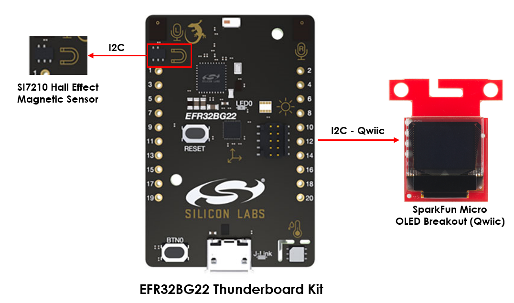
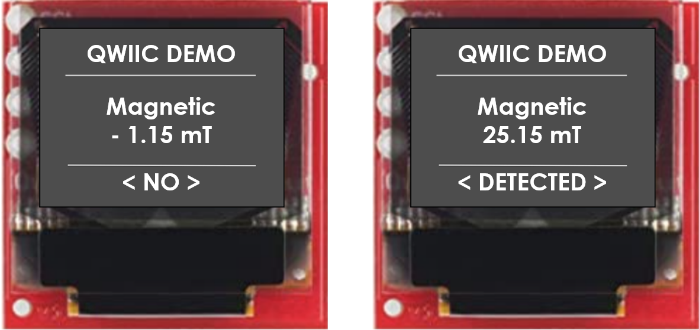
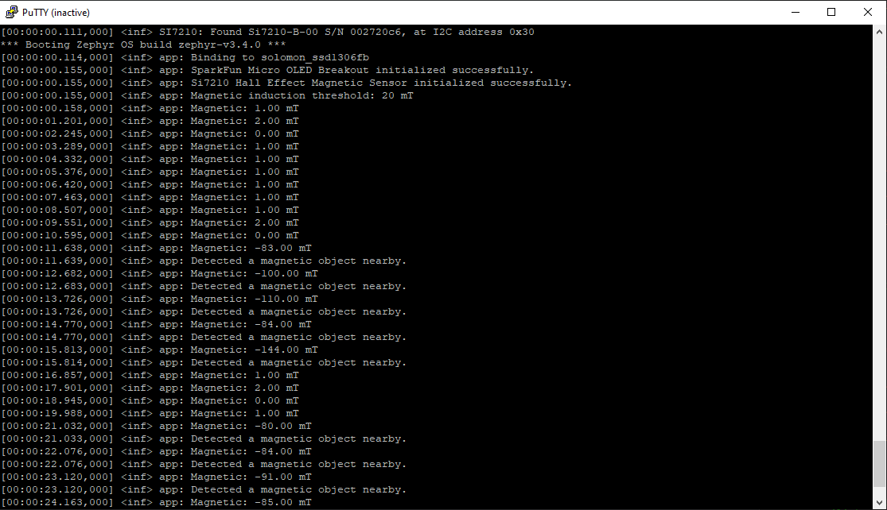

# Zephyr - Qwiic Connector #

[-green)](https://www.sparkfun.com/products/14532)

## Summary ##

The vision of this project is to provide developers with clear examples of integrating the Si7210 Hall Effect Magnetic sensor with the Zephyr OS on various Silicon Labs development kits.

The example demonstrates the utilization of the onboard SI7210 Hall sensor with Zephyr OS. The development kits will be connected to a Sparkfun Qwiic OLED through onboard Qwiic Connector, and the application detects the presence of magnetic objects in the vicinity. The detected proximity should be visualized on the OLED screen with a scale. By showcasing the proximity detection capabilities on a Sparkfun Qwiic OLED, we aim to enable developers to build innovative and practical IoT applications using magnetic sensors and Zephyr OS.

## Hardware Required ##

 - [EFR32BG22 Thunderboard Kit - BRD4184A](https://www.silabs.com/development-tools/thunderboard/thunderboard-bg22-kit?tab=overview)

 - [SparkFun Micro OLED Breakout (Qwiic)](https://www.sparkfun.com/products/14532)

**NOTE:**
Tested boards for working with this example:

| Board ID | Description  |
| -------- | ------------ |
| BRD4184A | [EFR32BG22 Thunderboard Kit - BRD4184A](https://www.silabs.com/development-tools/thunderboard/thunderboard-bg22-kit?tab=overview) |
| BRD2601B | [EFR32xG24 Development  Kit - DK2601B](https://www.silabs.com/development-tools/wireless/efr32xg24-dev-kit?tab=overview) |
| BRD2602A | [EFR32xG27 Development  Kit - DK2602A](https://www.silabs.com/development-tools/wireless/efr32xg27-development-kit?tab=overview) |

## Connections Required ##

The following picture shows the system view of how it works.

The boards and OLED display can connect via the I2C interface. You simply connect the SparkFun Micro OLED Breakout board to a EFR32BG22 Thunderboard Kit board using a Qwiic cable. If you are using the **EFR32BG22 Thunderboard Kit** or **EFR32xG27 Development Kit**, which do not have Qwiic connector, you can make the connection according to the table below:

| EFR32BG22 Thunderboard Kit  | SparkFun Micro OLED |
|:----------------------------|:-------------------:|
|  2 (VMCU)  |  3V3  |
|  1 (GND)   |  GND  |
|  16 (PD2)  |  SDA  |
| 15 (PD3)   |  SCL  |

| EFR32xG27 Development Kit  | SparkFun Micro OLED |
|:---------------------------|:-------------------:|
|  2 (VMCU)  |  3V3  |
|  1 (GND)   |  GND  |
|  16 (PD2)  |  SDA  |
| 15 (PD3)   |  SCL  |

## Setup ##

To run the example, you should follow the below steps:

1. Copy this example folder to the `zephyrproject/zephyr/samples` folder or any under the **zephyrproject** root directory.

2. Run **Command Prompt** as administrator and change the current working directory to this project directory.

3. Copy the `drivers/display/ssd1306.c` file to the `zephyrproject/zephyr/drivers/display` directory (overwriting the existing file).

4. Build this project by the following commands with each tested board.

   - EFR32BG22 Thunderboard Kit - BRD4184A: **`west build -p -b efr32bg22_brd4184a`**

   - EFR32xG27 Development Kit - DK2602A: **`west build -p -b efr32bg27_brd2602a`**

   - EFR32xG24 Development Kit - DK2601B: **`west build -p -b efr32xg24_dk2601b`**

5. Flash the project to the board using **`west flash`** command.

**Note:**

- Make sure that the Zephyr OS environment is already installed. For installing the Zephyr OS environment, you can refer to [this guide](../README.md#setting-up-environment).

- You need to install the SEGGER RTT J-Link driver to flash this project to the board. For further information, please refer to [this section](../README.md#flash-the-application).

## How It Works ##

This example demonstrates the utilization of the Qwiic connector with the Silabs EFR32BG22 Thunderboard Kit on Zephyr OS.

The SparkFun Micro OLED Breakout is used for visualizing sensor data. The display will show the magnetic induction value every second. If this value is greater than its threshold, the screen is visible with the `< DETECTED >` text of if not, it will display `< NO >` text, like the following image.

You can launch a Console that is integrated into Simplicity Studio or use a third-party terminal tool like Putty or Tera Term to receive the data from the USB.  You can see the threshold of magnetic induction and its value is logged out to your screen. You also receive a notification about the indication of a magnetic object when it is nearby. A screenshot of the console output is shown in the figure below.

The animation below showcases the demo of this project.

Moreover, you can configure the magnetic configuration value by running `west build -t menuconfig` or `west build -t guiconfig` command on this example working directory, which has the **Kconfig** file. Then, the project configuration window will appear as below.

|  | |
| ------------------------------------- | -------------------------------- |

After finishing the configuration, you have to re-build this example before flashing it to the board.
