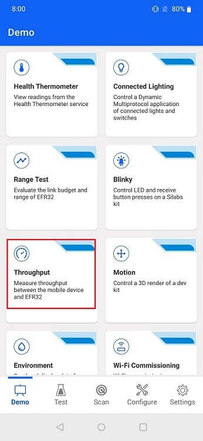
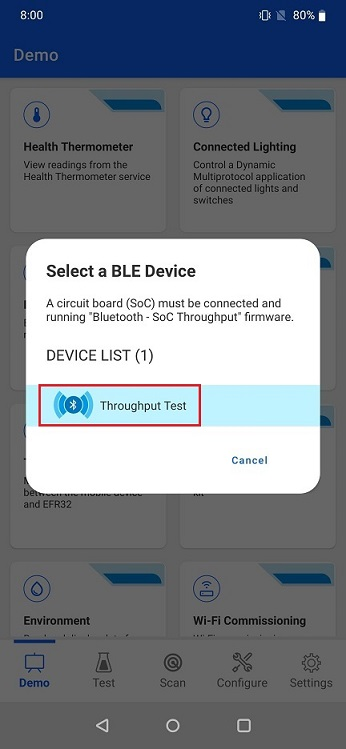
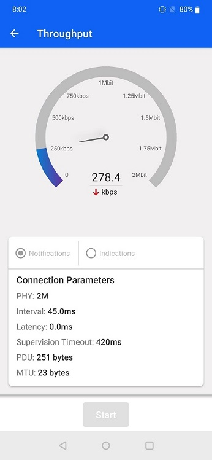
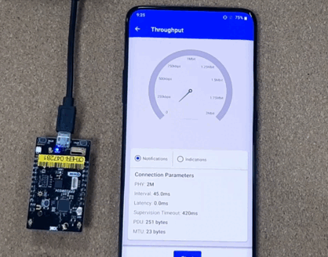
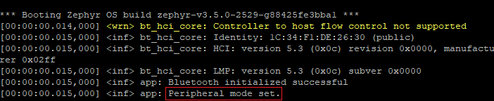
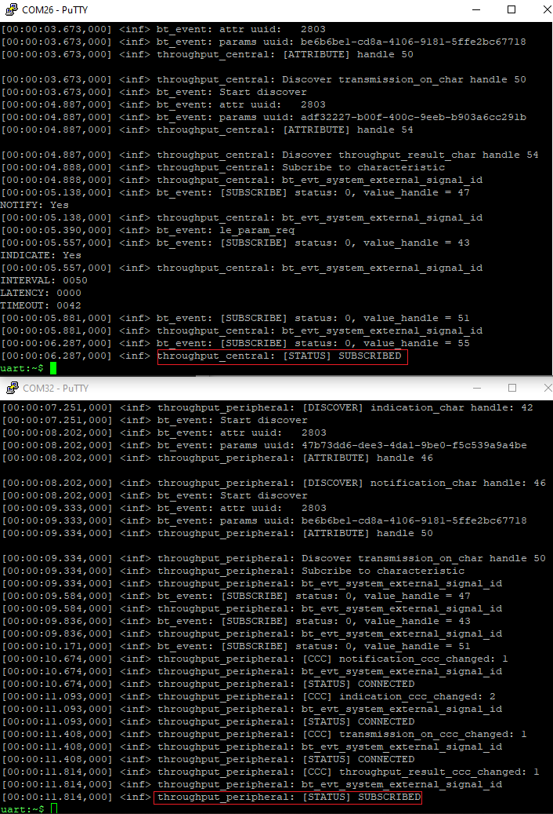
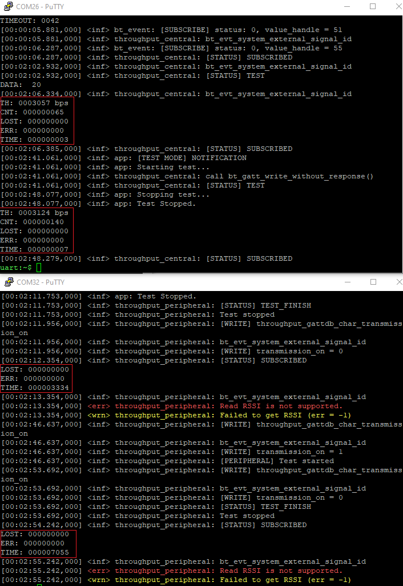
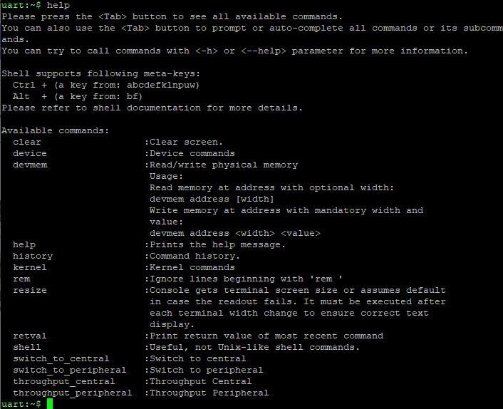
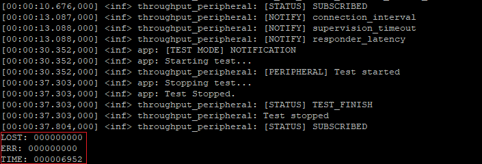

# Zephyr - SoC - Throughput #

## Summary ##

The example demonstrates how the Zephyr OS is supported by the development kits of Silicon Labs. This example allows measuring data throughput between EFR32 devices as well as between an EFR32 and a smartphone running the EFR Connect mobile app.

## Hardware Required ##

- [EFR32xG24 Dev Kit](https://www.silabs.com/development-tools/wireless/efr32xg24-dev-kit?tab=overview)

## Connections Required ##

In this example, only one board required, which is the EFR32xG24 Dev Kit. Devices transmit data to the EFR Dev Kit via Bluetooth Low Energy (BLE).

## Setup ##

To run the example, you should follow the below steps:

1. Copy this example folder to the `zephyrproject/zephyr/samples` folder or any under the **zephyrproject** root directory.

2. Run **Command Prompt** as administrator and change the current working directory to this project directory.

3. Build this project by the following commands with each tested board.

   - EFR32xG24 Dev Kit - BRD2601B: **`west build -p -b efr32xg24_dk2601b`**

4. Flash the project to the board using **`west flash`** command.

**Note:**

- Make sure that the Zephyr OS environment has already been installed. For installing the Zephyr OS environment, you can refer to [this guide](../README.md#setting-up-environment).

- You need to install the SEGGER RTT J-Link driver to flash this project to the board. For further information, please refer to [this section](../README.md#flash-the-application).

## How It Works ##

This example implements a GATT service that can be used to measure application data throughput using acknowledged or unacknowledged transactions, namely indications or notifications.

This throughput measurement setup has two use cases:

1. EFR32 (SoC) <-> Mobile phone + EFR Connect
2. EFR32 (SoC) <-> EFR32 (SoC)

### EFR32 (SoC) <-> Mobile phone + EFR Connect

In this use case, only one developer kit is required. After flashing the example code to the board, the firmware boots as a peripheral device by default, and the mobile phone acts as a central device.

Open EFR Connect application, then navigate to the Demo view and select the item Throughput. After clicking of the icon, a pop-up appears, which shows all the devices that are running the **Bluetooth - SoC Throughput** firmware. Select the Throughput Test option from the Device List.

 

Data can be pushed to the smartphone by pressing PB0 on the mainboard. The behavior is determined by the button press duration:
* Short press switches between sending notifications or indications. The default out of boot is sending notifications.
* Long press is used to send data.
* To boot into central mode instead of peripheral mode, keep the button pressed as you reset the device.

From the mobile application, data can be pushed to the EFR32 board by tapping the Start button at the bottom of the screen. The data transfer type (notifications/indications) can be selected at the top of the connection parameters window.

The below animation demonstrates how to transfer data by long-pressing the button of the Dev Kit. Data is sent from an EFR32xG24 Dev Kit to the EFR Connect BLE Mobile application.

### EFR32 (SoC) <-> EFR32 (SoC)

This device setup requires two developer kits, which can exchange data via BLE.

In this this use case, the **Bluetooth - SoC Throughput** example must be flashed on both dev kits. By default, the firmware boots in peripheral mode, however it can boot into central mode by keeping PB0 pressed, while resetting the device. The role can be read from the first line on the display.

Throughput testing can start as soon as the devices establish a connection and subscribe to indications/notifications on each other's GATT database. The status is indicated on the second line of the display. When both side show "ST: Subscribed" then testing is ready to start.

Notifications can be pushed by pressing PB0. The data can be sent from either device since both have the throughput service on their GATT database, and they subscribe to notifications/indications on the GATT of the remote device.

Data is sent as long as the button is pressed on the device, and the status is "ST: Testing" during that time.

Once the button is released, the average throughput is calculated and shown on the display, as well as, how many packets were sent. This information is visible in the two last lines of the display.

### CLI (Command Line Interface)

The **Bluetooth - SoC Throughput** example has a CLI that is used to report activity as well as to modify parameters in runtime. You can easily access the CLI with a terminal emulator such as Tera Term or from [Simplicity Studio](https://www.silabs.com/developers/simplicity-studio) by right-clicking the debug adapter and selecting Launch Console. On the Serial 1 tab, type "help" on the command prompt.

 

The available command set allows multiple options such as changing connection parameters, MTU size, TX power, among others.

On devices without display, the CLI is used for printing a virtual display, which mimics the physical display on the main board.

 

